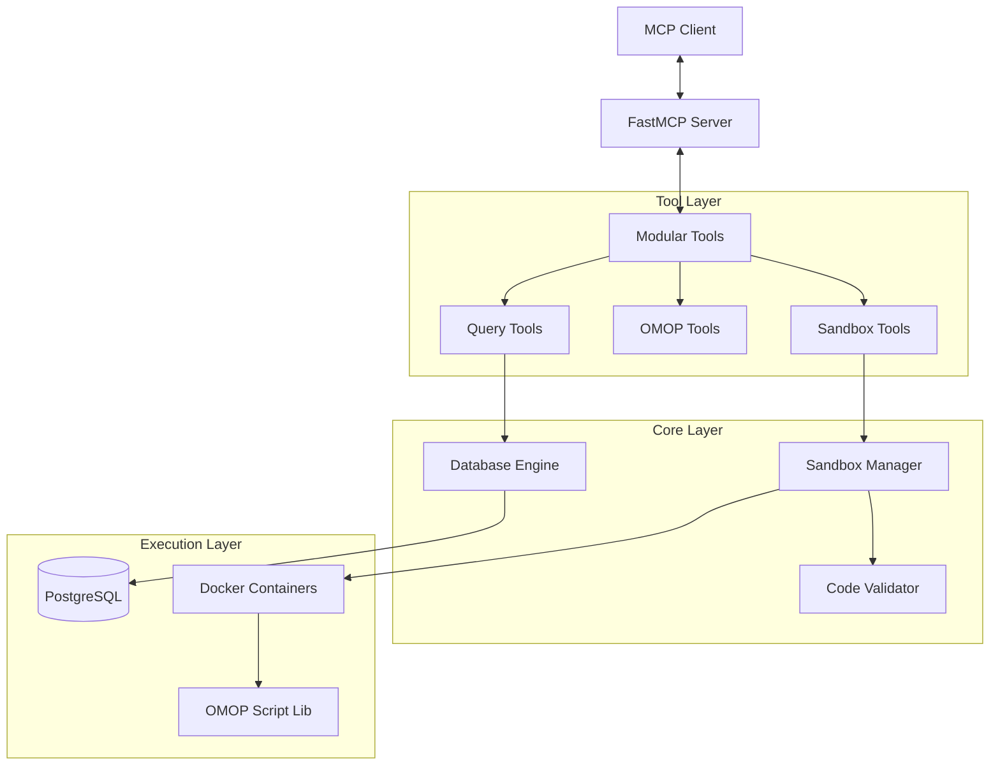

# OMCP Python Sandbox Server


A secure, modular, Docker-based Python sandbox server implementing the Model Context Protocol (MCP). Designed for safe code execution and advanced healthcare data analytics (OMOP CDM).

## 🚀 Key Features

- **Secure Sandboxing**: Executes Python code in isolated, ephemeral Docker containers with no network access, read-only filesystems, and dropped capabilities.
- **Modular Architecture**: Clean separation of concerns with dedicated modules for sandbox lifecycle, OMOP operations, and direct queries.
- **Healthcare Ready**: Built-in tools for creating OMOP schemas, loading Synthea data, and performing patient cohort analysis.
- **Performance Optimized**: "Fast Path" direct query tools bypass container overhead for read-only operations.
- **Security First**: Static code validation, robust timeout enforcement, and secure credential injection.

## 🏗️ Architecture

The system uses a layered architecture:



## 🛠️ Installation

### Prerequisites
- Python 3.10+
- Docker Engine
- `uv` package manager (recommended)

### Setup

1. **Clone the repository:**
   ```bash
   git clone https://github.com/yourusername/omcp_py.git
   cd omcp_py
   ```

2. **Configure Environment:**
   ```bash
   cp sample.env .env
   # Edit .env with your Docker and Database settings
   ```

3. **Install Dependencies:**
   ```bash
   uv sync
   # OR
   pip install -e .
   ```

4. **Start the Database (Optional):**
   ```bash
   docker-compose up -d
   ```

## 🚀 Usage

Start the MCP server:

```bash
uv run src/omcp_py/main.py
# OR
python3 src/omcp_py/main.py
```

### Available Tools

| Tool Category | Tools | Description |
|---------------|-------|-------------|
| **Sandbox** | `create_sandbox` | Create a new isolated environment |
| | `execute_python_code` | Run secure Python code |
| | `install_package` | Install PyPI packages safely |
| | `list_sandboxes` | Manage active containers |
| **OMOP** | `create_omop_schema` | Initialize healthcare database schema |
| | `load_synthea_to_postgres` | Import synthetic patient data |
| | `analyze_omop_data` | Run pre-built analytics |
| **Query** | `query_omop_table` | **Fast Path** direct database read |
| | `query_duckdb` | Query local DuckDB files (uses `DB_PATH` if set) |
| | `Get_information_Schema` | List available schemas/tables (DuckDB or Postgres) |
| | `Select_Query` | Execute read-only SQL (DuckDB if `DB_PATH` set, else Postgres) |

Note: `install_package` installs into `/sandbox/packages`. The sandbox runtime adds this path to `PYTHONPATH` for subsequent executions. Network access is required for package downloads.

### DuckDB Configuration

Set `DB_PATH` to point to a DuckDB file to enable DuckDB-backed queries for `query_duckdb`, `Get_information_Schema`, and `Select_Query`. If `DB_PATH` is not set, `Select_Query` and `Get_information_Schema` use the configured Postgres connection.

By default, `query_duckdb` falls back to `synthetic_data/synthea.duckdb` when `DB_PATH` is unset.

## 🔒 Security Model

- **Code Validation**: User code is scanned for dangerous imports (`os`, `subprocess`) before execution.
- **Container Isolation**:
  - `network_mode="none"` (default): No internet access.
  - `read_only=True` (default): Filesystem cannot be modified.
  - `cap_drop=["ALL"]`: All Linux capabilities removed.
  - `pids_limit=50`: Prevents fork bombs.
- **Resource Limits**: Configurable CPU and Memory caps.

To enable database access from sandboxes, set `SANDBOX_NETWORK` to your Docker network (or `auto` to attach to the compose network if detected). If `SANDBOX_NETWORK` is unset and a compose network is detected, the sandbox will auto-attach when `DB_HOST` is not `localhost`/`127.0.0.1`.

## 📁 Project Structure

```
src/omcp_py/
├── core/           # Core logic (Globals, DB)
├── security/       # Security validators
├── tools/          # MCP Tool implementations
│   ├── sandbox_tools.py
│   ├── omop_tools.py
│   └── query_tools.py
├── scripts/        # Standalone script library
│   └── omop/       # Helper scripts injected into containers
└── main.py         # Entry point
```

## 📄 License

MIT
