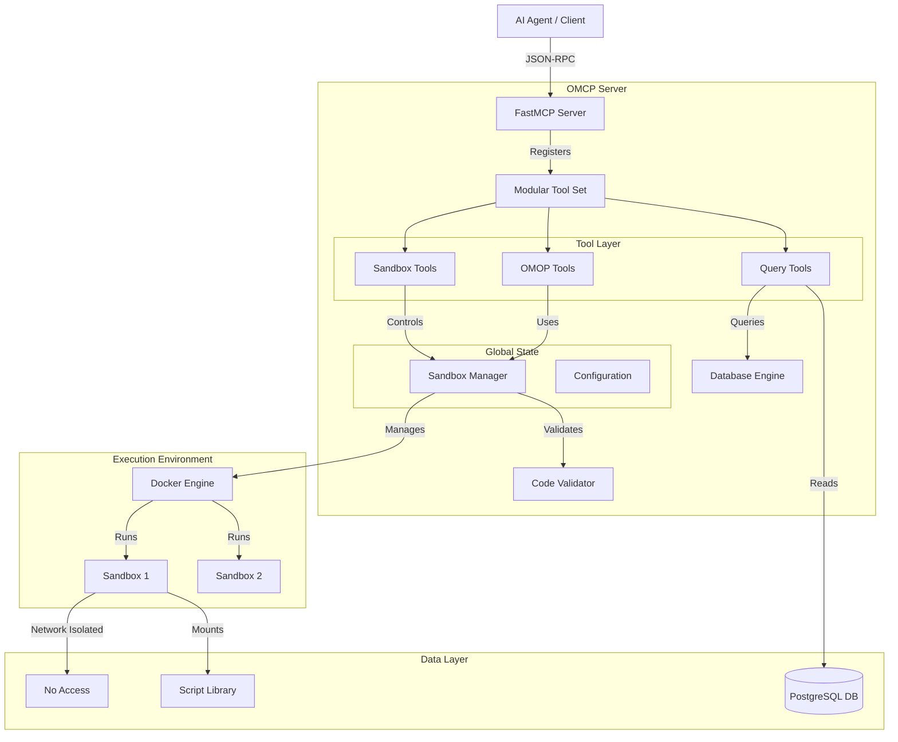

# System Architecture

## Overview

The OMCP Python Sandbox is designed as a secure, modular system for executing untrusted Python code and performing healthcare data analytics. It bridges the gap between AI agents (via MCP) and secure execution environments (Docker).

## High-Level Architecture

## Core Components

### 1. FastMCP Server (`main.py`)
The entry point of the application. It is now a lightweight "glue" layer that:
- Initializes the `FastMCP` server instance.
- Loads configuration.
- Registers tool modules.
- Starts the STDIO transport.

### 2. Modular Tool Layer (`src/omcp_py/tools/`)
Tools are organized by domain to ensure maintainability:
- **`sandbox_tools.py`**: Manages the lifecycle of sandboxes (create, list, remove) and generic code execution.
- **`omop_tools.py`**: specialized tools for healthcare data operations (schema creation, Synthea loading, analytics). These tools inject pre-written scripts into the sandbox.
- **`query_tools.py`**: A "Fast Path" for read-only database operations. It bypasses the Docker container for simple `SELECT` queries, offering much lower latency.

### 3. Sandbox Manager (`src/omcp_py/sandbox_manager.py`)
A singleton service responsible for:
- **Container Lifecycle**: Creating, starting, stopping, and removing Docker containers.
- **Protocol Management**: translating "execute code" requests into `docker exec` commands.
- **Security Enforcement**: Applying resource limits, network isolation, and capability dropping.
- **Timeout Management**: Ensuring runaway processes are terminated using system-level timeouts.

### 4. Code Validator (`src/omcp_py/security/code_validator.py`)
A security component that performs static analysis (AST parsing) on user-submitted code *before* it is sent to the sandbox. It proactively blocks:
- Dangerous imports (e.g., `os`, `subprocess`, `socket`).
- Dangerous built-ins (e.g., `exec`, `eval`).

### 5. Script Library (`src/omcp_py/scripts/`)
Instead of embedding large Python code strings inside the application logic, complex operations are defined as standalone Python scripts. These scripts are loaded at runtime, configured via environment variables, and executed inside the sandbox. This allows for:
- Better testing of isolated logic.
- Proper syntax highlighting and linting.
- Easier updates to business logic.

## Data Flow

### Sandbox Execution Flow
1. **Request**: Agent calls `execute_python_code(code="...")`.
2. **Validation**: `CodeValidator` checks the AST of the code.
3. **Execution**: `SandboxManager` sends the code to the Docker container via `exec_run`.
4. **Result**: Output (stdout/stderr) is captured and returned to the agent.

### OMOP Tool Flow
1. **Request**: Agent calls `create_omop_schema()`.
2. **Loading**: `omop_tools` reads `src/omcp_py/scripts/omop/create_schema.py`.
3. **Injection**: Database credentials are injected as environment variables (pre-pended python code).
4. **Execution**: The script runs inside the container, connecting to the DB.

## Security Architecture

security is enforced at multiple layers:
1. **Application Layer**: Input validation and static code analysis.
2. **Container Layer**:
   - **Isolation**: No network access (`network_mode="none"`).
   - **Privilege**: Non-root user, dropped capabilities (`cap_drop=["ALL"]`).
   - **Filesystem**: Read-only root filesystem with limited `tmpfs` mounts.
3. **Host Layer**: Resource limits (CPU/RAM) and PIDs limits to prevent DoS.